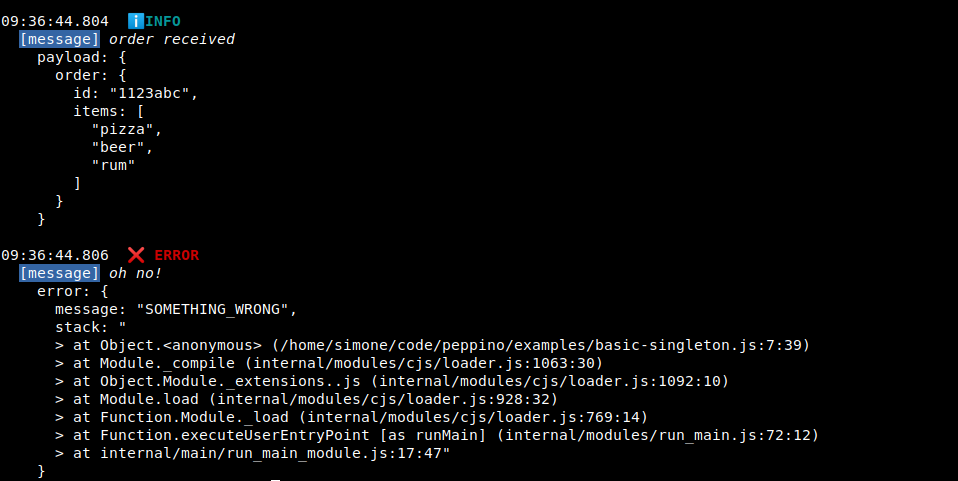

# peppino

[](https://www.npmjs.org/package/peppino)
[](https://www.npmjs.org/package/peppino)
[](http://standardjs.com/)

preset of pino

## Purpose

Ready-to-use rich tool for dev and debug while relay on [pino](https://github.com/pinojs) great performace in production.

## Installing

````bash
npm i peppino
````

## Quick start

singleton

```js
const log = require('peppino')
log.init({ pretty: true })

log.warn({ message: 'info' })
```

output



multiple instances

```js
const log = require('peppino')
const _logger1 = log.init({ singleton: false, pretty: true, level: 'info' })
const _logger2 = log.init({ singleton: false, level: 'silent' })

_logger1.info({ message: 'info' })
_logger2.info({ message: 'none' })
```

output


## Settings

Default settings:

```js
{
  level: 'warn',
  pretty: false,
  version: '',
  name: '',
  namespaces: {
    filter: null
  },
  singleton: true,
  original: null
}
```

- **level**
  set logger level
- **pretty**
  pretty output
- **version**
  append version on each log entry
- **name**
  append instance name (usually service name) on each log entry
- **namespaces**
  use namespaces and apply filter on `pretty`
- **singleton**
  use the singleton or create a new indipendent instance with different settings
- **original**
  append original [pino options](https://github.com/pinojs/pino/blob/master/docs/api.md#options)

## Methods

### .init

init logger with settings, everything is optional

### .set

update settings for the singleton or existing instance

### .timer

utility for measure time

```js
const log = require('peppino')
log.init()

log.timer('db-query')
// db.query ...
log.info({ message: 'query execution', time: log.timer('db-query') })
```

> {"level":"INFO","time":1591218836285,"message":"query execution","timer":"123 ms"}

NOTE: max timer duration in 10 minutes, if `timer` is not called the second time with the same tag, it is automatically cleaned after 10 mins.

### .pino

you may need the pino original instance with current settings, i.e. to pass to `fastify`

```js
const log = require('peppino')
log.init()

const pino = log.pino()
```

---

### Namespaces

Use namespaces and apply filter; filter can be: `string` or `string[]` or `RegExp`.  
Only for pretty print

```js
const log = require('peppino')
log.init({
  pretty: true,
  level: 'info',
  name: 'auth-service',
  namespaces: { filter: ['db'] }
})

// will be printed
log.success({ ns: 'db', message: 'connected' })

// will be skipped
log.error({
  ns: 'socket',
  message: 'connection timeout',
  socket: { address: '192.168.100.123', port: 9909 }
})
```

---

### Levels

`panic`, `success` and `fail` are added to the original levels.

Full ordered set is: 
- `panic`
- `fatal`
- `error`
- `warn`
- `success`
- `fail`
- `info`
- `debug`
- `trace`  

or  

`silent`

---

### Formatters

Specify how to format keys adding the formatter to log entries keys

```js
log.error({
  ns: 'socket',
  message: 'connection timeout',
  'timestamp:epoch': Date.now()
})
```

output


Available formatters are:

- `epoch`: format epoch time to ISO
- `filesize`: format bytes to human readable

Formatters can be customized or extended as follow

```js
log.init({
  formatters: {
    // override default "epoch" formatter
    epoch: value => new Date(value).toLocaleString(),
    // add formatter for file name to print only the filename
    filename: value => path.basename(value)
  }
})
```

---

## TODO

- [ ] test coverage
  - [ ] test formatters
- [ ] full trace by `stack-trace`
- [ ] custom serializers

---

## License

The MIT License (MIT)

Copyright (c) 2020 [Simone Sanfratello](https://braceslab.com)

Permission is hereby granted, free of charge, to any person obtaining a copy
of this software and associated documentation files (the "Software"), to deal
in the Software without restriction, including without limitation the rights
to use, copy, modify, merge, publish, distribute, sublicense, and/or sell
copies of the Software, and to permit persons to whom the Software is
furnished to do so, subject to the following conditions:

The above copyright notice and this permission notice shall be included in all
copies or substantial portions of the Software.

THE SOFTWARE IS PROVIDED "AS IS", WITHOUT WARRANTY OF ANY KIND, EXPRESS OR
IMPLIED, INCLUDING BUT NOT LIMITED TO THE WARRANTIES OF MERCHANTABILITY,
FITNESS FOR A PARTICULAR PURPOSE AND NONINFRINGEMENT. IN NO EVENT SHALL THE
AUTHORS OR COPYRIGHT HOLDERS BE LIABLE FOR ANY CLAIM, DAMAGES OR OTHER
LIABILITY, WHETHER IN AN ACTION OF CONTRACT, TORT OR OTHERWISE, ARISING FROM,
OUT OF OR IN CONNECTION WITH THE SOFTWARE OR THE USE OR OTHER DEALINGS IN THE
SOFTWARE.
